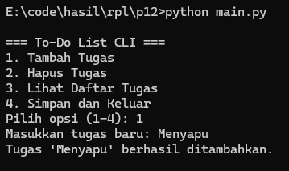
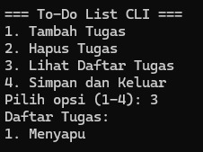
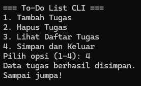
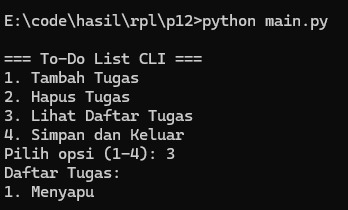
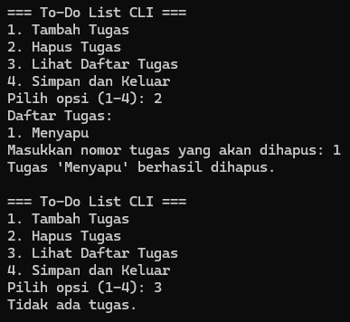

# TodoList_Sederhana

## Pendahuluan

### Tujuan
Dokumen ini menjelaskan kebutuhan fungsional dan non-fungsional dari **Aplikasi To-Do List Sederhana** yang dibangun menggunakan Python. Sistem ini bertujuan untuk membantu pengguna mencatat, menampilkan, dan mengelola daftar tugas melalui antarmuka terminal (CLI).

### Lingkup
Sistem memungkinkan pengguna untuk:
- Menambahkan tugas baru
- Menghapus tugas yang sudah tidak diperlukan
- Menampilkan seluruh daftar tugas
- Menyimpan daftar tugas ke file lokal.

### Definisi, Akronim, dan Singkatan

| Istilah | Arti |
|--------|------|
| CLI | Command Line Interface |
| SRS | Software Requirements Specification |
| Task | Tugas atau kegiatan yang ingin dicatat |
| JSON | JavaScript Object Notation, format penyimpanan data |
| User | Pengguna akhir aplikasi |

---

## Deskripsi Umum

### Perspektif Produk
Aplikasi ini adalah sistem **standalone** yang berjalan di terminal. Tidak memerlukan koneksi internet atau database eksternal. Semua data disimpan secara lokal dalam file `tasks.json`.

### Fungsi Sistem
- Menampilkan daftar tugas saat ini
- Menambahkan tugas baru ke dalam daftar
- Menghapus tugas berdasarkan nomor
- Menyimpan perubahan ke dalam file
- Membaca ulang data ketika program dijalankan.

### Karakteristik Pengguna
Pengguna adalah individu yang ingin mencatat atau mengatur daftar tugas harian. Aplikasi dirancang untuk pengguna umum tanpa keahlian teknis. Operasi dilakukan melalui input angka dan teks di terminal.

---

## Kebutuhan Fungsional

| Kode | Nama Fitur | Deskripsi |
|------|------------|-----------|
| RF001 | Tampilkan Tugas | Sistem menampilkan semua tugas yang telah dicatat. |
| RF002 | Tambah Tugas | Pengguna dapat menambahkan tugas baru ke daftar. |
| RF003 | Hapus Tugas | Pengguna dapat menghapus tugas berdasarkan nomor urut. |
| RF004 | Simpan Tugas | Sistem menyimpan daftar tugas dalam file lokal. |
| RF005 | Muat Tugas | Sistem membaca kembali data tugas dari file saat aplikasi dijalankan. |

---

## Kebutuhan Non-Fungsional

| Kode | Deskripsi |
|------|-----------|
| RNF001 | Sistem memberikan respons terhadap input pengguna dalam < 1 detik. |
| RNF002 | Dapat dijalankan pada Python 3.x tanpa library tambahan. |
| RNF003 | Antarmuka berbasis teks yang mudah digunakan. |
| RNF004 | Berjalan secara offline dan tidak tergantung pada sistem operasi tertentu. |

---

## Antarmuka Sistem

### Antarmuka Pengguna
- CLI berbasis teks
- Input melalui angka (untuk pilihan) dan teks (untuk isi tugas).
  
### Antarmuka Perangkat Keras
- Komputer dengan Python 3.x
- Tidak membutuhkan perangkat tambahan.

### Antarmuka Perangkat Lunak
- Menggunakan interpreter Python standar
- File JSON untuk menyimpan data
- Tidak menggunakan library eksternal.

### Batasan Sistem
- Tidak menyimpan riwayat perubahan tugas
- Tidak mendukung pengguna ganda atau multi-session
- Tidak memiliki antarmuka grafis (GUI)
- Hanya menyimpan data secara lokal tanpa enkripsi.

### Lampiran

#### Struktur Kode
     todolist/
     ├── main.py # Menjalankan program utama
     ├── task_manager.py # Fungsi tambah, hapus, dan tampilkan tugas
     ├── storage.py # Fungsi simpan dan muat file JSON
     └── utils.py # Fungsi bantu tampilan menu dan input

#### Screenshot Hasil Running

- **Tambah Tugas**
  
  

- **Lihat Daftar Tugas**
  
  

- **Simpan dan Keluar**
  
  

- **Masuk Ulang Program**
  
  

- **Hapus Tugas**
  
  

#### Diagram Alur Sistem

                                                                 +-----------+
                                                                 |   Mulai   |
                                                                 +-----------+
                                                                       |
                                                                       v
                                                              +-----------------+
                                                              |  Tampilkan Menu |
                                                              +-----------------+
                                                                       |
                                                                       v
                                                          +--------------------------+
                                                          | Pilihan:                 |
                                                          | 1. Tambah Tugas          |
                                                          | 2. Hapus Tugas           |
                                                          | 3. Tampilkan Daftar      |
                                                          | 4. Keluar                |
                                                          +--------------------------+
                                                                       |
                                                                       v
                                                          (Alur berdasarkan pilihan)
                                                                       |
                           ----------------------------------------------------------------------------------------
                           |                                           |                                          |
                           |                                           |                                          |
                           |                                           |                                          |
                           v                                           v                                          v
              +-----------------------------+            +-----------------------------+            +-----------------------------+
              | Jika Pilih Hapus Tugas      |            | Jika Pilih Tampilkan Daftar |            | Jika Pilih Keluar           |
              | → Masukkan nomor tugas      |            | → Cetak daftar tugas        |            | → Program selesai           |
              | → Hapus dari daftar         |            +-----------------------------+            +-----------------------------+
              +-----------------------------+
